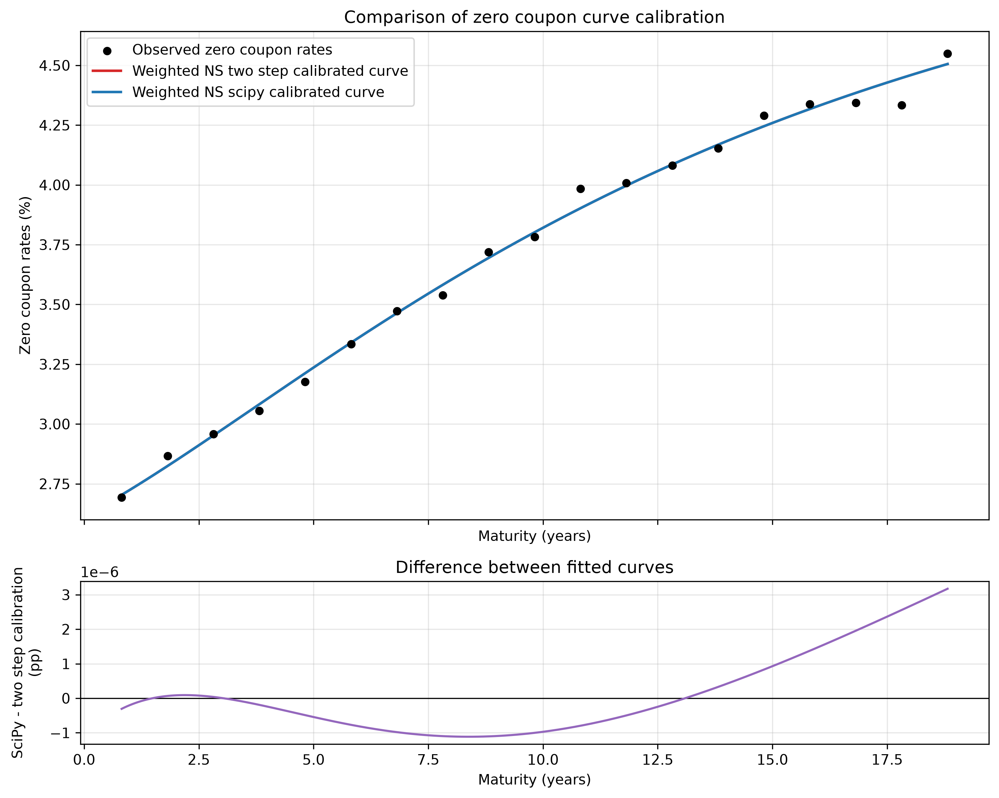
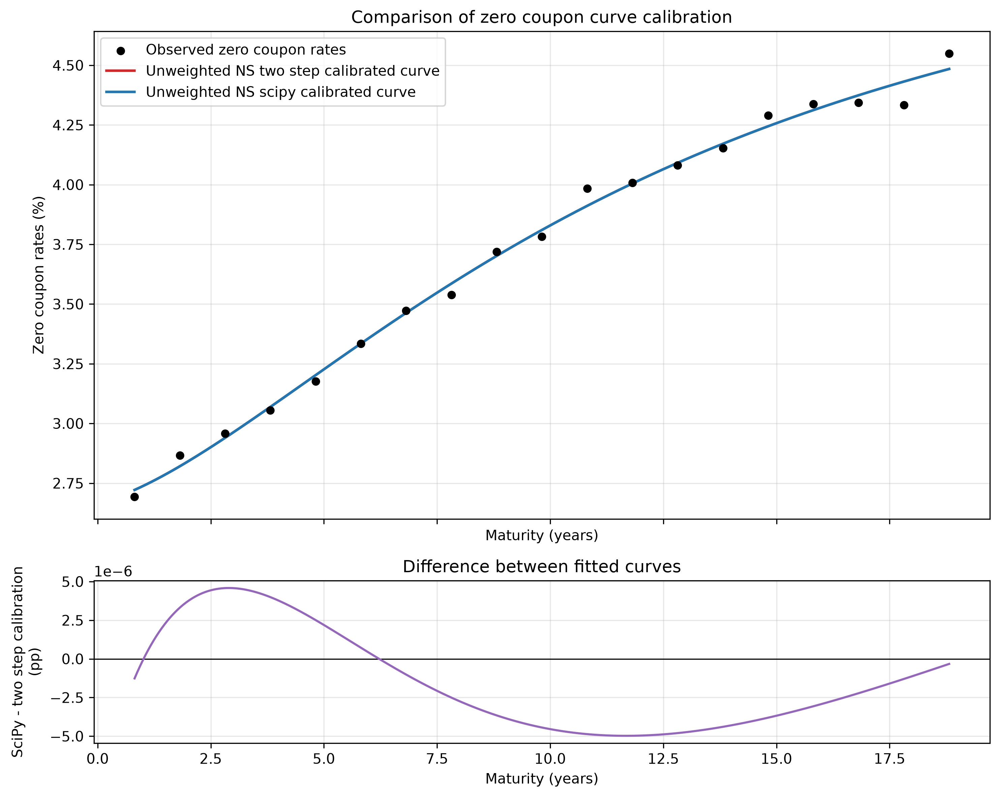
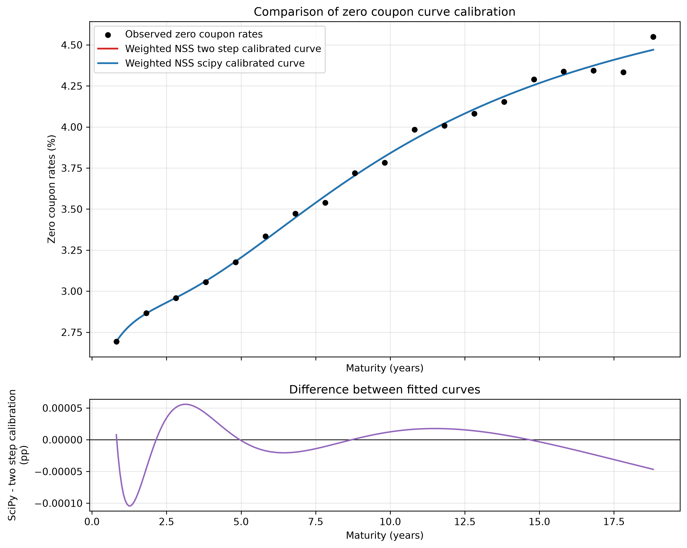
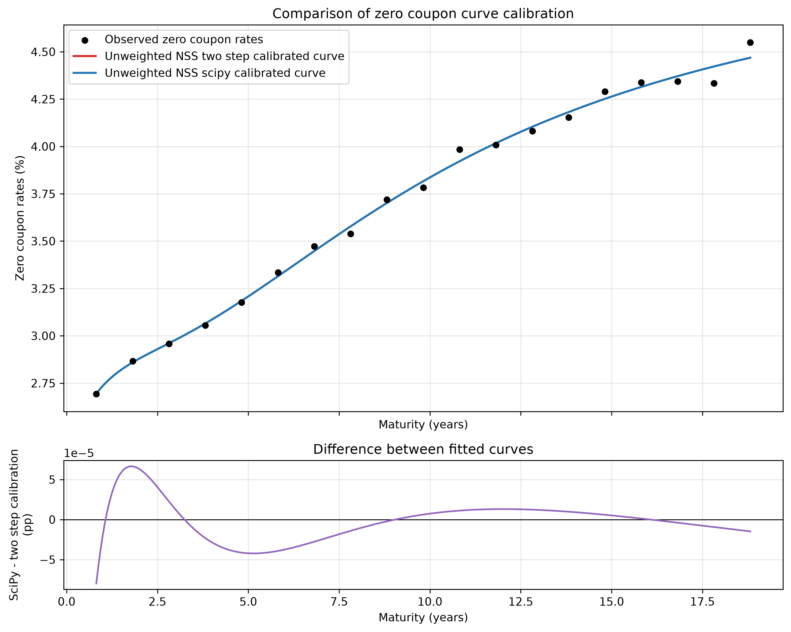

# Nelson-Siegel-Svensson Calibration of the French OAT Zero-Coupon Curve

## Why this project?

A bootstrapped zero-coupon curve only gives rates at the maturities of the bonds it was built from. In my case, that is 19 French OATs between 2027 and 2045. But pricing, hedging, or risk work needs the rate at *any* maturity *t*, not only at those 19 points.

**The question: how can we turn a discrete set of bootstrapped zero-coupon rates into a smooth, continuous curve, and can we trust the parameters that come out of it?**

## Approach

I fit the **Nelson-Siegel-Svensson** model, a parsimonious curve with six parameters that have an economic reading (long-term rate, slope, curvature), to the zero-coupon curve from my own from-scratch bootstrap. The calibration is done with a custom two-step method and benchmarked against a joint `scipy` optimization. I also test an inverse-duration weighting, which is designed to improve the fit on short and medium maturities at the expense of the long end.

The answer on the reliability of the parameters is in [Why a Good Fit Is Not Enough](#why-a-good-fit-is-not-enough-identifiability); the full methodology is in [Calibration Methods](#calibration-methods).

## Context

This project was built as part of my search for a work-study position (*alternance*) in quantitative finance, with a focus on fixed income and credit.

## Contents

- [Data](#data)
- [Model](#model)
- [Calibration Methods](#calibration-methods)
- [Weighting Scheme](#weighting-scheme)
- [Project Structure](#project-structure)
- [Usage](#usage)
- [Results](#results)
  - [Calibration Curves](#calibration-curves)
  - [Model Selection with AIC/BIC](#model-selection-with-aicbic)
- [Requirements](#requirements)
- [References](#references)

## Data

All inputs come from my own from-scratch bootstrap project ([link to the bootstrap repository](https://github.com/Target-Justin/Zero-Coupon-Yield-Curve-Bootstrap)), which builds the zero-coupon curve from French OAT prices and characteristics.

**Sources:**
- **Euronext**: clean prices
- **Agence France Trésor**: all other data (bond characteristics, cash flows)

The pipeline uses four input files located in `data/raw/`:

- `dataset.csv`: bond characteristics, including maturity, valuation date, day-count convention, etc.
- `cashflow.csv`: coupon and principal cash flows for each bond and payment date
- `dirty_price.csv`: dirty bond prices, computed as Euronext clean prices plus accrued interest
- `zero_rate.csv`: bootstrapped zero-coupon rates for 19 French OATs with maturities ranging from 2027 to 2045, used as the calibration target

### Bond metrics

For each bond, let `CF_k` be the cash flows paid at times `t_k` (in years from the valuation date). The **dirty price** is the clean price plus accrued interest, and the **yield-to-maturity** `y` (continuous compounding) solves:

```text
P_dirty = Σ_k CF_k · exp(-y · t_k)
```

This equation is solved with Newton-Raphson (`scripts/bond_metrics/yield_to_maturity.py`):

```text
f(y)    = Σ_k CF_k · exp(-y · t_k) - P_dirty
f'(y)   = -Σ_k t_k · CF_k · exp(-y · t_k)
y_{n+1} = y_n - f(y_n) / f'(y_n)
```

The **Macaulay duration** (`scripts/bond_metrics/duration.py`) is the present-value-weighted average time of the cash flows:

```text
D = (1 / P_dirty) · Σ_k t_k · CF_k · exp(-y · t_k)
```

Under continuous compounding it equals the modified duration, `-(1/P) · dP/dy`. It is used to build the weights described in [Weighting Scheme](#weighting-scheme).

## Model

The zero-coupon yield at maturity `t` is a combination of level, slope and curvature factors:

```text
y(t) = β1 + β2 · x_1(t) + β3 · x_2(t) + β4 · x_3(t)      (β4 · x_3 : NSS only)
```

with the factor loadings:

```text
x_1(t) = (1 - exp(-t/λ1)) / (t/λ1)                    slope
x_2(t) = (1 - exp(-t/λ1)) / (t/λ1) - exp(-t/λ1)       first curvature
x_3(t) = (1 - exp(-t/λ2)) / (t/λ2) - exp(-t/λ2)       second curvature (NSS only)
```

All loadings vanish as `t → ∞`, and the curvature loadings also vanish as `t → 0`. The parameters therefore have a direct reading:

```text
lim t→∞ y(t) = β1         long-term rate
lim t→0 y(t) = β1 + β2    short-term rate
```

The two model specifications are:

- **Nelson-Siegel (NS)**: 3 beta parameters and 1 lambda parameter, for a total of 4 parameters
- **Nelson-Siegel-Svensson (NSS)**: 4 beta parameters and 2 lambda parameters, for a total of 6 parameters

For NSS, the optimization is subject to the identifiability constraint:

```text
λ2 > λ1 + 1
```

This prevents the two curvature factors from becoming too similar and helps avoid severe collinearity.

Once the lambdas are fixed, the model is linear in the betas: `y = Xβ + ε`, where row `i` of `X` is `[1, x_1(t_i), x_2(t_i), x_3(t_i)]` (without `x_3` for NS). The OLS solution is:

```text
unweighted:  β̂ = (XᵀX)⁻¹ Xᵀ y
weighted:    β̂ = (XᵀWX)⁻¹ XᵀW y,    W = diag(1/D_1, …, 1/D_n)
```

### Why a Good Fit Is Not Enough: Identifiability

Minimizing the SSR criterion turns out to be the easy part. Over a wide range of lambda values, the fit comes out numerically almost identical — because the two curvature factors (`x_2`, built from `λ1`, and `x_3`, built from `λ2`) become highly correlated whenever `λ1` and `λ2` sit close to each other over the observed maturity range. The SSR surface is flat there. Many different `(λ1, λ2, β3, β4)` combinations give fits that look indistinguishable, even though they aren't actually the same fit.

Strictly speaking this isn't an infinite continuum of exact global minima — for any fixed `(λ1, λ2)` the OLS step still has a unique solution. But with finite data, optimizer tolerances, and floating-point precision, the objective behaves as if it were one: a large chunk of the parameter space is "good enough" on SSR alone, and two different optimization routines can land on different points within that chunk without either being wrong.

That's the reason for two safeguards in this project:

- the grid search throws out candidate lambda pairs whose implied factor loadings are too correlated (above a fixed threshold) before any local refinement runs;
- the NSS specification enforces `λ2 > λ1 + 1`, keeping the two curvature factors identifiable rather than just close to each other.

Skip these and the calibration can converge to parameters that fit the data numerically but don't mean much economically — a curvature factor with an implausible lambda, say, or two curvature terms that basically duplicate each other. This isn't hypothetical: in the results below, the two-step and joint-optimization approaches converge to different values for β3 and λ1 in the NSS specification (in the weighted case, β3 ≈ 0 vs 0.20 and λ1 = 0.80 vs 0.86), despite producing nearly identical SSR. That's the near-degenerate region of the objective surface showing up directly in the numbers. Finding *a* fit is easy. Finding one whose parameters actually mean something is the harder and more interesting part of this exercise.

## Calibration Methods

Two independent calibration approaches are implemented.

### 1. Two-step calibration

The `calibrate_nss` procedure separates the optimization of the nonlinear and linear parameters.

1. The objective function is constructed using the sum of squared rate residuals (SSR), either unweighted or weighted by inverse duration.
2. The lambda parameters are searched using a coarse grid search followed by a local refinement:
   - `adaptive_step_search` for NS
   - `nelder_mead` for NSS (own implementation, as opposed to `scipy.optimize.minimize` in the joint approach)
   - for NSS, during the grid search, a pair `(λ1, λ2)` is discarded when `|corr(x_2(t_i), x_3(t_i))| > ρ_max`, with `ρ_max = 0.5`
3. Conditional on the optimized lambda parameters, the beta parameters are estimated using OLS.
4. For the weighted specification, the OLS step uses the same inverse-duration weighting.

This approach exploits the linear structure of the beta parameters and reduces the nonlinear optimization problem to the lambda parameters.

### 2. Joint optimization

The `sp_calibration` procedure optimizes the full parameter vector jointly:

```text
[β1, β2, β3, β4, λ1, λ2]
```

using `scipy.optimize.minimize` with the Nelder-Mead algorithm.

The objective function is the same SSR criterion used by the two-step approach, with the same weighting scheme and the same admissibility constraints. The initial point is obtained from the grid-search / OLS procedure used by the two-step calibration.

The two approaches therefore differ mainly in how the parameter space is explored:

- the **two-step approach** explicitly exploits the linearity of the beta parameters;
- the **joint approach** treats all model parameters as a single optimization vector.

This provides a useful cross-check on the numerical calibration while keeping the underlying statistical objective unchanged.

## Weighting Scheme

The weighting scheme is inspired by the approach used by Gürkaynak, Sack and Wright (2007) in their estimation of the U.S. Treasury yield curve.

The Federal Reserve methodology gives more importance to observations associated with shorter-duration instruments by using inverse duration as a weighting mechanism. The intuition is that errors on short-duration securities can have a different economic significance from errors on long-duration securities.

The present implementation adopts the same **inverse-duration intuition**, but applies it directly to the yield curve rather than to bond price errors.

More precisely, the objective function is based on zero-coupon **rate residuals**:

```text
SSR = Σ wi · (y_observed(ti) - y_model(ti))²
```

with

```text
wi = 1 / Duration_i
```

for the weighted specification, and

```text
wi = 1
```

for the unweighted specification.

This differs from the Federal Reserve implementation in an important but deliberate way. The original methodology works with price deviations, whereas this project calibrates the model directly to zero-coupon rates. Applying the inverse-duration weights directly to rate residuals keeps the entire calibration in rate space.

This is simpler for the present application because:

- the calibration target is already a zero-coupon yield curve;
- no additional conversion from yield errors to price errors is required;
- the objective remains directly interpretable as a weighted error on the yield curve;
- the same objective can be used consistently across the NS and NSS specifications.

The weighting therefore preserves the main intuition of the Federal Reserve approach — giving relatively more importance to shorter-duration instruments — while using a simpler rate-based formulation suited to this project.

## Project Structure

```text
main.py                                          # complete calibration pipeline
scripts/
├── nss_factors.py                               # x_1, x_2, x_3, build_factor_loadings_matrix,
│                                                # unpack_scipy_result
├── plot_zero_rates_curve.py                     # observed curve + fitted curves
├── utils/
│   └── utils.py                                 # to_ql_date, get_day_counter
├── bond_metrics/
│   ├── yield_to_maturity.py                     # generate_yield_to_maturity (Newton-Raphson)
│   ├── duration.py                              # generate_duration (Macaulay duration)
│   └── numerical_methods/
│       └── newton_raphson.py
└── calibration_methods/
    ├── calibrate.py                             # calibrate_nss (two-step method)
    ├── ssr_scoring.py                           # build_ssr_score
    ├── grid_search.py
    ├── nelder_mead.py                           # 2D refinement for NSS
    ├── local_search.py                          # adaptive_step_search for NS
    ├── ols.py                                   # OLS and weighted OLS routines
    └── scipy_calibration/
        └── scipy_calibrate.py                   # calculate_ssr, sp_calibration
```

## Usage

The calibration settings are defined at the top of `main.py`:

```python
is_ns = False       # True: Nelson-Siegel; False: Nelson-Siegel-Svensson
is_weighted = True  # True: inverse-duration weighting; False: unweighted
```

Run the complete pipeline with:

```bash
python main.py
```

The pipeline:

1. loads the raw bond and zero-rate data;
2. computes yields-to-maturity and durations;
3. calibrates the selected model using both calibration approaches;
4. exports the calibration results to `results/`;
5. plots the observed zero-coupon curve together with the fitted curves.

## Results

For each configuration (`{model}` = `ns` / `nss`, `{weighting}` = `weighted` / `unweighted`), the pipeline produces:

- `results/{model}_{weighting}_parameters.csv`: calibrated beta and lambda parameters, together with the SSR for each calibration method
- `results/{model}_{weighting}_comparison.csv`: observed and fitted rates at each bond maturity, together with the difference between the two calibration methods in basis points
- `results/{model}_{weighting}.png`: observed curve and fitted curves, with a residual comparison panel
- a console summary containing the SSR of both methods, the relative SSR difference, and the maximum and average absolute differences between the two fitted curves (in basis points)

The two calibration methods are compared with:

```text
Δ_i = (y_joint(t_i) - y_two-step(t_i)) × 100                 [bp, rates in %]
relative SSR difference = |SSR_joint - SSR_two-step| / SSR_two-step
```

`Δ_i` is the `DiffBp` column of the `comparison.csv` files.

### Calibration Curves

The calibration plots compare the bootstrapped zero-coupon curve with the curves obtained from the two calibration approaches:

- **Two-step calibration**
- **Joint SciPy optimization**

Each figure also includes a lower panel showing the difference between the two fitted curves.

The plots are generated by `plot_zero_rates_curve.py` and saved automatically by `main.py` under `results/`.

#### Nelson-Siegel — Weighted



#### Nelson-Siegel — Unweighted



#### Nelson-Siegel-Svensson — Weighted



#### Nelson-Siegel-Svensson — Unweighted



The figure shown for a given configuration is produced from the bootstrapped zero-coupon observations together with the fitted curves from both calibration methods. The exact configuration generated by a given run is controlled by `is_ns` and `is_weighted` in `main.py`.

### Empirical Results Across the Four Configurations

| Weighting | Model | Method | β1 | β2 | β3 | β4 | λ1 | λ2 | SSR |
|---|---|---|---:|---:|---:|---:|---:|---:|---:|
| Unweighted | NS | Two-step | 5.5465 | -2.8819 | -2.4811 | — | 3.8171 | — | 0.030650 |
| Unweighted | NS | Scipy | 5.5465 | -2.8819 | -2.4810 | — | 3.8173 | — | 0.030650 |
| Unweighted | NSS | Two-step | 5.3210 | -2.9611 | ~0 | -5.3853 | 0.8689 | 2.5128 | 0.026648 |
| Unweighted | NSS | Scipy | 5.3208 | -2.9617 | 0.0308 | -5.3867 | 0.8770 | 2.5121 | 0.026648 |
| Weighted | NS | Two-step | 5.7856 | -3.1716 | -2.2026 | — | 4.7109 | — | 0.004003 |
| Weighted | NS | Scipy | 5.7857 | -3.1716 | -2.2026 | — | 4.7110 | — | 0.004003 |
| Weighted | NSS | Two-step | 5.3097 | -3.0013 | ~0 | -5.4757 | 0.8036 | 2.4544 | 0.002297 |
| Weighted | NSS | Scipy | 5.3093 | -2.9989 | 0.1975 | -5.4807 | 0.8577 | 2.4528 | 0.002298 |

For all four configurations, the joint optimization reaches an SSR within 0.03% of the two-step calibration (relative difference), and the two fitted curves never differ by more than 0.01 bp at any bond maturity.

In NS, both methods land on the same point: parameters agree to the third or fourth decimal. In NSS, the fitted curves are indistinguishable, but the parameters are not exactly the same. The two-step method sets β3 to ~0, whereas the joint optimization keeps a small positive β3 (0.03 unweighted, 0.20 weighted), with λ1 shifted by about 1% and 7% respectively. The other parameters (β4, λ2) agree within 0.1%. The weighted case is the clearer illustration of the identifiability issue (see [Why a Good Fit Is Not Enough](#why-a-good-fit-is-not-enough-identifiability)).

For the date considered here, the observed curve is monotonically increasing, without a pronounced double-hump shape.

### Model Selection with AIC/BIC

The Akaike and Bayesian information criteria are computed as:

```text
AIC = n · ln(SSR / n) + 2k
BIC = n · ln(SSR / n) + k · ln(n)
```

with:

- `n = 19` observations
- `k = 4` parameters for NS
- `k = 6` parameters for NSS

| Weighting | Model | k | SSR | AIC | BIC |
|---|---|---:|---:|---:|---:|
| Unweighted | NS | 4 | 0.030650 | **−114.16** | **−110.38** |
| Unweighted | NSS | 6 | 0.026648 | −112.82 | −107.15 |
| Weighted | NS | 4 | 0.004003 | −152.84 | −149.06 |
| Weighted | NSS | 6 | 0.002297 | **−159.39** | **−153.72** |

The information criteria therefore give different model-selection results depending on the weighting scheme. Under the unweighted objective, the reduction in SSR obtained with NSS does not compensate for its additional parameters. Under the inverse-duration weighting, the improvement in fit is sufficient to offset the additional model complexity.

These comparisons should be interpreted within each weighting scheme, since the weighted and unweighted objectives correspond to different fitting criteria.

## Requirements

Developed and tested with:

```text
numpy==2.5.1
scipy==1.18.0
pandas==3.0.5
QuantLib==1.43
```

Install with `pip install -r requirements.txt`.

## References

- Gilli, M., Große, S. & Schumann, E. (2010). *Calibrating the Nelson-Siegel-Svensson model*. COMISEF Working Paper.
- Wahlstrøm, R. R., Paraschiv, F., & Schürle, M. (2021). *A comparative analysis of parsimonious yield curve models with focus on the Nelson-Siegel, Svensson and Bliss versions*. Journal of Risk and Financial Management.
- Gürkaynak, R. S., Sack, B., & Wright, J. H. (2007). *The U.S. Treasury Yield Curve: 1961 to the Present*. Finance and Economics Discussion Series, Federal Reserve Board.
